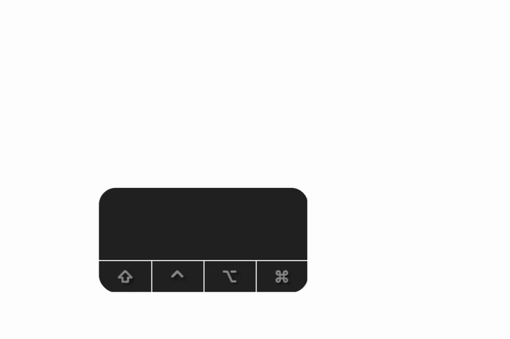
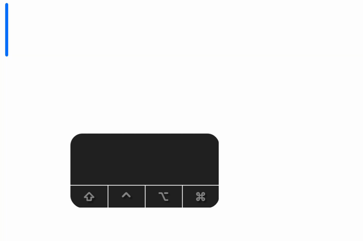

# 하늘키보드 (HaneulKeyboard)

<p align="center">
  <a href="https://github.com/Hyunjin-Cho/HaneulKeyboard/releases/latest"></a>
  <a href="https://github.com/Hyunjin-Cho/HaneulKeyboard/releases"></a>
  <a href="https://github.com/Hyunjin-Cho/HaneulKeyboard/blob/main/LICENSE"></a>
  <a href="https://github.com/Hyunjin-Cho/HaneulKeyboard/actions/workflows/ci.yml"></a>
  <a href="#요구사항"></a>
</p>

빠른 한↔영 전환과 안정적인 한글 입력을 위한 macOS 메뉴바 유틸리티 + 입력기(IME).

사랑하는 딸 **하늘**이의 이름에서 따왔습니다.

## 데모

> 한글 모드인 채로 영어를 치면 — 깨진 한글이 **스페이스를 누르는 순간** 자동으로 영어로 바뀝니다.

<p align="center">
  <br><br>
  <br><br>
  
</p>

## 주요 기능

- **안정적인 한글 조합** — 전용 입력 소스로 자모 깨짐 없이 한글을 조합합니다.
- **빠른 한/영 전환** — Caps Lock(짧게)으로 즉시 전환. 시스템 native 경로를 사용해 결정적으로 동작합니다.
- **영타 자동 변환** *(2026.02 신규 · 2026.03 사전 현대화)* — 한글 모드인 줄 모르고 영어를 쳤을 때, 스페이스를 누르는 순간 자동으로 영어로 바꿔줍니다. `메ㅔㅣㄷ`→`apple`, `ㅡ드ㅐ교`→`memory`, `how ㅁㄱㄷ you`→`how are you`. 올바른 한글과 ㅋㅋㅋ·ㅗㅜㅑ 같은 표현은 건드리지 않습니다 — **우리말샘 표제어 67.7만 개**로 실존 한국어를 확인합니다 (단 하나의 예외: 영어 문맥 직후의 새→to·무→an·내→so·랙→for·뭉→and 명시 목록). 2026.03부터 `and`·`city`·`playlist` 같은 기본·현대어와 `davinci`·`ronaldo` 같은 인명까지 변환합니다.
- **Caps Lock 대문자 모드** — Caps Lock 길게 LED 토글(대문자 모드).
- **메뉴바에서 제어** — 한국어/영어 전환, 설정을 메뉴바 아이콘에서. 영타 변환은 설정에서 켜고 끌 수 있습니다.

한↔영 입력에만 집중합니다. 다른 언어 지원 및 다른 기능은 없습니다.

## 설치

[GitHub Releases](https://github.com/Hyunjin-Cho/HaneulKeyboard/releases)에서 최신 버전을 받으세요.

### 설치 방법 (일반 사용자)

1. 다운로드한 `.zip` 압축 풀고 `HaneulKeyboard.app`을 **응용 프로그램(`/Applications/`)** 폴더로 복사
2. `HaneulKeyboard.app` 더블클릭 → 메뉴바에 아이콘 표시
3. 메뉴바 아이콘 → **"시작하기..."** → 온보딩 따라가기
   - **"IME 설치"** 버튼 클릭 (`~/Library/Input Methods/`에 설치)
4. **시스템 설정 → 키보드 → 입력 소스 → "+" → 한국어 → "하늘키보드 (두벌식)"** 추가
5. (선택) 기존 시스템 한국어 입력기(두벌식)는 제거 권장 — 자모 깨짐 방지 효과

> **⚠️ 참고**: 한/영 전환은 **Caps Lock**으로 합니다 — macOS 시스템 기능(`TICapsLockLanguageSwitchCapable`)에 위임하므로 **별도 권한이 필요 없습니다.** 짧게 눌러 한/영 전환, 길게(1초+) 눌러 대문자 Caps Lock.

## 사용법

- **Caps Lock** 짧게 누름 → 한/영 전환
- **Caps Lock** 길게 누름 → Caps Lock LED 토글 (대문자 모드)
- 하늘 키보드에서 영어단어를 치면 전환 가능

### 영타 자동 변환 (2026.02 · 2026.03 사전 현대화)

한글 모드에서 영어 단어를 치면 — 예: `apple`이 `메ㅔㅣㄷ`로 보임 — **스페이스/문장부호를 누르는 순간 자동으로 영어로 교정**됩니다. 별도 조작이 필요 없습니다.

- 직전 단어가 영어면 짧은 단어도 이어서 교정: `how ㅁㄱㄷ you` → `how are you`, `thank you 내 much 랙` → `thank you so much for`, `apples 뭉 oranges` → `apples and oranges`
- **올바른 한글은 건드리지 않습니다**: 실존 한국어 단어(우리말샘 67.7만 표제어 대조), ㅋㅋㅋ·ㅎㄷㄷ·ㅇㄱㄹㅇ 같은 초성체, ㅗㅜㅑ·ㅡㅁㅡ 같은 표현은 전부 보호됩니다. (단 하나의 예외: 영어 문맥 직후의 새→to·무→an·내→so·랙→for·뭉→and 명시 화이트리스트 — "thank you 내 much"처럼 영어 흐름 안에서는 영어 의도가 우세하다고 봅니다.)
- *(2026.03)* **영어 사전 현대화** — 1934년판 시스템 사전의 빈자리를 공개 데이터로 보강했습니다: 고빈도 일상어 [NGSL](https://www.newgeneralservicelist.com)(`city`·`with`), 현대어·굴절형 [SCOWL](https://wordlist.aspell.net)(`playlist`·`internet`·`selfie`), 영어 인명 US Census·SSA + 유명인(`davinci`·`ronaldo`·`garcia`). 추가된 모든 단어는 **한국어 충돌 검역**(실제 조합 엔진 시뮬레이션, [`scripts/audit_wordlist.sh`](./scripts/audit_wordlist.sh))을 통과한 것만 — 한국어 보호 원칙은 그대로입니다.
- 변환은 직접 타이핑한 경계에서만 일어나고, 마우스 클릭·앱 전환 시에는 화면에 보이던 그대로 입력됩니다.

## 요구사항

- **macOS Sonoma (14.0) 이상** — macOS Tahoe (26.x)에서 테스트 완료
- Apple Silicon (M1/M2/M3/M4) 및 Intel 모두 지원

## 알려진 문제

- **후보 창(팝업)에서 입력 중인 글자가 연하게 표시됨** — 사용상 문제는 없어 현재 상태를 유지합니다.
- **현재 두벌식만 지원** — 다른 자판(세벌식 등)이 필요하면 [Issues](https://github.com/Hyunjin-Cho/HaneulKeyboard/issues)로 요청해주세요. 수요가 있으면 추가를 검토합니다.
- **일부 사이트/앱에서 동작하지 않을 수 있음** — 애초에 자모 결합 입력을 지원하지 않는 특정 웹사이트/앱에서는 입력기 종류와 무관하게 입력이 깨질 수 있습니다.
- **웹 브라우저의 비밀번호 칸에 한글이 입력될 수 있음** — 네이버 등 브라우저의 비밀번호 칸은 macOS가 입력기를 차단하지 않아, **모든 한글 입력기(애플 기본 입력기 포함)에서 한글이 조합됩니다.** 입력기 종류와 무관한 macOS·브라우저의 동작이며, 비밀번호는 영문 모드(Caps Lock 짧게)로 입력하시면 됩니다. (시스템 설정 등 네이티브 비밀번호 칸은 macOS가 정상적으로 입력기를 차단합니다.)
- 위와 같은 문제를 겪는 사이트/앱이 있다면 [Issues](https://github.com/Hyunjin-Cho/HaneulKeyboard/issues)에 제보해주시면 큰 도움이 됩니다.
- 지원되는 OS에서 광범위한 테스트가 필요합니다. 편하게 [Issues](https://github.com/Hyunjin-Cho/HaneulKeyboard/issues)에 제보해주시면 개발에 큰 도움이 됩니다.

## 버전 체계

하늘키보드는 **CalVer(Calendar Versioning)** 를 따릅니다: `연도.릴리스[.핫픽스]`

- `2026.01`, `2026.02`, `2026.03` … — `2026`은 **연도**, 두 번째 칸은 **그 해의 릴리스 순번**입니다(달력의 월과 무관). 2026년 첫 릴리스가 `2026.01`, 두 번째가 `2026.02`.
- `2026.02.01`, `2026.02.02` … — **핫픽스(긴급 수정)가 있을 때만** 세 번째 칸을 덧붙입니다. 예) `2026.02` 출시 후 버그 수정본이 `2026.02.01`.

> 점으로 나뉜 각 칸은 독립된 정수이며 소수점이 아닙니다. 예) `2026.02.10`이 `2026.02.09`보다 최신입니다.

## 개발자용 빌드

```bash
# 1. 의존성 설치
brew install xcodegen

# 2. 프로젝트 생성
xcodegen generate

# 3. 빌드 (Debug)
xcodebuild -scheme HaneulKeyboard -configuration Debug build

# 4. 실행
open ~/Library/Developer/Xcode/DerivedData/HaneulKeyboard-*/Build/Products/Debug/HaneulKeyboard.app
```

메인 앱이 IME 번들(`HaneulKeyboardIM.app`)을 `Contents/Helpers/`에 자동 포함하므로 타겟 하나만 빌드하면 됩니다.

### 배포용 빌드 (Developer ID + Notarization)

```bash
scripts/build_notarize_install.sh HaneulKeyboard
```

Apple Developer ID 인증서 + notarytool 키체인 프로필(`haneul-notary`)이 사전에 등록되어 있어야 합니다.

### 구조

```text
HaneulKeyboard.app              # 메뉴바 앱
└── Contents/Helpers/
    └── HaneulKeyboardIM.app    # 입력기 번들 (IMKit)

~/Library/Input Methods/
└── HaneulKeyboardIM.app        # 설치 시 복사됨
```

| 번들 | 역할 | 기술 |
|---|---|---|
| `HaneulKeyboard.app` | 메뉴바 앱 — 언어 전환, IME 설치 | SwiftUI, TIS API |
| `HaneulKeyboardIM.app` | 한글 입력기 — 자모 조합 | IMKit, IMKInputController |

## 라이선스

MIT License — 자유롭게 사용, 수정, 배포하세요. 자세한 내용은 [`LICENSE`](./LICENSE) 파일을 참고하세요.

**데이터 파일 예외** (앱 코드는 MIT 그대로, 번들 데이터만 파일별 라이선스):

- 한국어 단어 목록([`Resources/IM/korean_words.txt`](./Resources/IM/korean_words.txt)) — 국립국어원 **우리말샘**에서 추출, [**CC-BY-SA 2.0 KR**](https://creativecommons.org/licenses/by-sa/2.0/kr/)
- 현대 영어 단어 목록 — **NGSL**(New General Service List, Browne·Culligan·Phillips)에서 추출, [**CC BY-SA 4.0**](https://creativecommons.org/licenses/by-sa/4.0/)
- 영어 단어 목록 보강 — **SCOWL/ESDB**([English Speller Database](https://wordlist.aspell.net), Kevin Atkinson)에서 추출, **MIT-like** (Copyright 2000-2026 by Kevin Atkinson)
- 영어 인명 목록 — **미국 인구조사국**(2010 Census 성씨)·**미국 사회보장국**(Baby Names) 데이터에서 추출, **public domain**
- 지명 목록([`english_sports_geo.txt`](./Resources/IM/english_sports_geo.txt) 일부) — **[GeoNames](https://www.geonames.org)**(북미·유럽 주/도·도시)에서 추출, [**CC BY 4.0**](https://creativecommons.org/licenses/by/4.0/)
- 축구 클럽·선수 목록(`english_sports_geo.txt` 일부) — **[Wikidata](https://www.wikidata.org)**(잉글랜드·프랑스·스페인·이탈리아 9개 리그)에서 추출, **CC0 1.0**(퍼블릭 도메인)

## 감사의 글

하늘키보드는 앞서 길을 닦아준 오픈소스와 도구들 위에 서 있습니다:

- **[McBopomofo](https://github.com/openvanilla/McBopomofo)** (OpenVanilla, MIT) — IME의 TIS(Text Input Services) 등록·설치 패턴에 큰 도움을 받았습니다.
- **[국립국어원 우리말샘](https://opendict.korean.go.kr)** (CC-BY-SA 2.0 KR) — 영타 자동 변환의 한국어 실존 단어 판정에 표제어 데이터를 사용합니다.
- **[Claude](https://claude.com/claude-code)** (Anthropic) — 개발 과정에 함께했습니다.

그리고 이 모든 것을 가능케 한, 인류가 쌓아 올린 오픈소스와 지식에 감사합니다. 전체 내용은 [감사의 글](./ACKNOWLEDGEMENTS.md)을 참고하세요.

## 제보 / 기여

실제로 써보고 불편한 점이나 버그를 [Issues](https://github.com/Hyunjin-Cho/HaneulKeyboard/issues)로 알려주세요. 특히 한글 입력이 깨지는 사이트/앱을 발견하면 제보해주시면 개선에 큰 도움이 됩니다. 적극적인 실사용과 피드백을 환영합니다.

<!-- 후원 링크 자리 (URL 확정 후 추가) -->

---

# English

A macOS menu bar utility for fast Korean ↔ English input switching and reliable Hangul typing, with a dedicated input method (IME).

Named after my daughter, 하늘 (Haneul) — "sky" in Korean.

## Features

- **Reliable Hangul composition** via a dedicated input source — no broken jamo.
- **Fast Korean/English switching** with Caps Lock (short press), using the system-native path for deterministic behavior.
- **Wrong-layout auto-correction** *(new in 2026.02, dictionaries modernized in 2026.03)* — typed English while in Korean mode? It fixes itself on commit: `메ㅔㅣㄷ`→`apple`, `how ㅁㄱㄷ you`→`how are you`. Genuine Korean is left alone — every candidate is checked against **677k Korean headwords** (국립국어원 우리말샘) plus slang/emoticon guards, with one deliberate exception (an explicit whitelist of 새→to/무→an/내→so/랙→for/뭉→and right after English context). 2026.03 modernizes the English dictionaries with [NGSL](https://www.newgeneralservicelist.com) high-frequency words (`city`, `with`), [SCOWL](https://wordlist.aspell.net) modern vocabulary (`playlist`, `internet`, `selfie`), and personal names from US Census/SSA data (`davinci`, `ronaldo`, `garcia`) — every addition passed a Korean-collision audit driven by the real composition engine.
- **Caps Lock uppercase mode** with a long press.
- **Menu bar control** for language switching, settings, and shortcuts. Wrong-layout auto-correction can be toggled in Settings.

Korean ↔ English input only. No other languages, no extra features.

## Install

Download the latest build from [GitHub Releases](https://github.com/Hyunjin-Cho/HaneulKeyboard/releases), copy `HaneulKeyboard.app` to `/Applications/`, double-click it, and follow the 4-step onboarding wizard.

## Requirements

macOS Sonoma (14.0) or later. Both Apple Silicon and Intel.

## Versioning

CalVer: `YEAR.RELEASE[.HOTFIX]`. The second field is the release number within the year (not the calendar month): `2026.01`, `2026.02`, `2026.03` … A third field is added only for hotfixes (e.g. `2026.02.01`). Each dot-separated field is an independent integer, not a decimal.

## License

MIT. See [`LICENSE`](./LICENSE).

**Data exceptions** (the app code remains MIT; only bundled data files carry their own licenses):

- Korean wordlist ([`Resources/IM/korean_words.txt`](./Resources/IM/korean_words.txt)) — extracted from the National Institute of Korean Language's **Urimalsaem (우리말샘)**, [**CC-BY-SA 2.0 KR**](https://creativecommons.org/licenses/by-sa/2.0/kr/)
- Modern English wordlist — derived from the **NGSL** (New General Service List, Browne, Culligan & Phillips), [**CC BY-SA 4.0**](https://creativecommons.org/licenses/by-sa/4.0/)
- English wordlist augmentation — derived from **SCOWL/ESDB** ([English Speller Database](https://wordlist.aspell.net), Kevin Atkinson), **MIT-like** (Copyright 2000-2026 by Kevin Atkinson)
- English name lists — derived from **US Census Bureau** (2010 Census surnames) and **US Social Security Administration** (Baby Names) data, **public domain**
- Place names (part of [`english_sports_geo.txt`](./Resources/IM/english_sports_geo.txt)) — derived from **[GeoNames](https://www.geonames.org)** (North American & European states/cities), [**CC BY 4.0**](https://creativecommons.org/licenses/by/4.0/)
- Football club & player names (part of `english_sports_geo.txt`) — derived from **[Wikidata](https://www.wikidata.org)** (9 leagues across England, France, Spain, Italy), **CC0 1.0** (public domain)

## Acknowledgements

Built on the shoulders of open source — gratitude to [McBopomofo](https://github.com/openvanilla/McBopomofo) (TIS registration patterns), [국립국어원 우리말샘](https://opendict.korean.go.kr) (Korean headword data, CC-BY-SA 2.0 KR), [Claude](https://claude.com/claude-code) (development), and the wider body of human knowledge. See [Acknowledgements](./ACKNOWLEDGEMENTS.md).

## Feedback

Please report bugs and broken sites/apps on the [Issues page](https://github.com/Hyunjin-Cho/HaneulKeyboard/issues).
