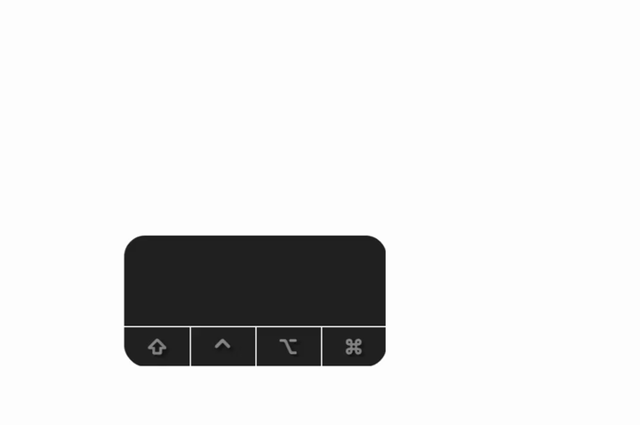
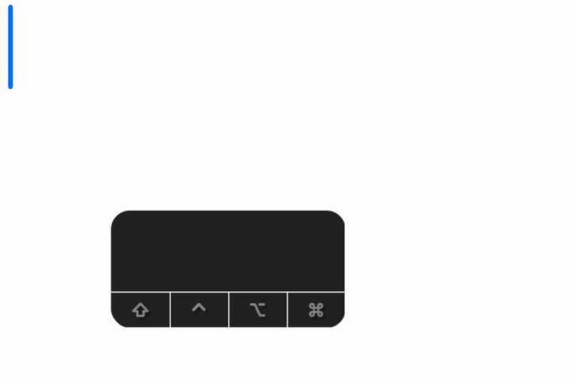

# 하늘키보드 (HaneulKeyboard)

<p align="center">
  <br>
  <a href="https://github.com/Hyunjin-Cho/HaneulKeyboard/releases"></a>
  <a href="https://github.com/Hyunjin-Cho/HaneulKeyboard/blob/main/LICENSE"></a>
  <a href="#요구사항"></a>
</p>

빠른 한↔영 전환과 한글 입력을 위한 macOS 메뉴바 앱 + 전용 입력기(IME)입니다. 사랑하는 딸 **하늘**이의 이름에서 따왔습니다.

> ⚠️ **베타버전이 끝났습니다. 이제 곧 정식버전이 출시됩니다. 조금만 기다려주세요.**
>
> 기준일: **2026-10-10**. 아래는 정식 출시를 준비 중인 현재 작업 트리의 기능 안내입니다. 기존 `2026.01`~`2026.07`은 베타 이력이며, 앱 설치 ZIP의 배포는 종료했습니다. GitHub의 **Source code** 파일은 설치 앱이 아닙니다. 정식 설치 파일은 준비가 끝나면 [배포 페이지](https://github.com/Hyunjin-Cho/HaneulKeyboard/releases)에 게시합니다.

## 어떤 앱인가요?

한글 모드인 줄 모르고 영어 단어를 입력했을 때, **Space나 문장부호로 단어를 끝내면** 영어로 바로잡습니다. `메ㅔㅣㄷ` → `apple`처럼 **자판을 잘못 선택해 생긴 입력**을 고치는 기능입니다.

| 하고 싶은 일 | 사용 방법 |
|---|---|
| 한글 ↔ 영어 전환 | Caps Lock 짧게 누르기 |
| 대문자 Caps Lock | Caps Lock 길게 누르기 |
| 영타 자동 변환 | 한글 모드에서 영어 단어를 입력한 뒤 Space 또는 문장부호 |
| 바뀐 단어 되돌리기 | **Shift+Space**. 다시 누르면 영어로 돌아갑니다. |
| 자동으로 바뀌지 않은 단어 직접 전환 | 확정된 커서 앞 단어에서 **Shift+Space** (`ㅡ5` ↔ `m5`, `ㅏ3` ↔ `k3`) |
| 등록된 발음을 영문으로 | **Shift+Space** (`레스토랑` → `restaurant`). 다시 누르면 원래 한글로 돌아갑니다. |
| 내 단어 추가·변환 금지 | 설정 → **개인 사전** |
| 안내 다시 보기 | 메뉴바 → **시작하기 다시 보기...** |

현재는 두벌식 한글·영어 입력을 지원합니다. 출시 준비 코드에는 **등록된 한글 발음 → 영문 표기** 변환도 포함되어 있으며, 설치본 검증은 [#84](https://github.com/Hyunjin-Cho/HaneulKeyboard/issues/84)에서 추적합니다.

## 데모

아래 영상은 영타 자동 변환의 동작 예시입니다. 현재 안내 화면과 아이콘은 새 디자인으로 바뀌었습니다.

<p align="center">
  <br><br>
  <br><br>
  
</p>

## 설치와 5단계 시작하기

**정식 설치 파일 게시 후** 다음 순서로 설치합니다.

1. 배포 페이지의 `HaneulKeyboard_<버전>.zip`을 받아 압축을 풉니다.
2. `HaneulKeyboard.app`을 **응용 프로그램(`/Applications`)** 폴더에 넣고 실행합니다.
3. 메뉴바의 하늘키보드 아이콘 → **시작하기...**를 엽니다.
4. 1단계의 **하늘키보드 설치**를 누르고, 2단계 안내에 따라 **시스템 설정 → 키보드 → 텍스트 입력 → 편집 → + → 한국어 → 하늘키보드 (두벌식)**을 추가·선택합니다. macOS 버전에 따라 설정 화면의 배치는 다를 수 있습니다.
5. 3·4단계에서 자동 변환과 되돌리기를 연습하고, 5단계에서 메뉴바 사용법을 확인합니다.

기존 Apple ‘두벌식’은 필요에 따라 제거하고, 영어 입력용 **ABC는 남겨 주세요**. Caps Lock 전환은 macOS 기능을 사용하며 별도의 손쉬운 사용 권한을 요구하지 않습니다.

안내 화면은 종이 질감, 단청 처마, 색동, 한복 인물로 구성했습니다. 인물은 **페이지마다 다른 다섯 자세**로 표시되며 다음·이전으로 넘길 때 바뀝니다. 3·4단계의 입력칸에서는 직접 연습할 수 있습니다. 설치·설정이 아직 끝나지 않았다면 마지막 화면에서 설치 단계로 돌아갈 수 있습니다.

**제거:** 메뉴바 → 설정 → **고급 → 전체 제거...**에서 앱·입력기·설정을 정리할 수 있습니다. 앱만 휴지통으로 옮긴 경우의 입력기 정리 동작과 확인 방법은 [수동 검사 안내](docs/manual-test-checklist.md)를 참고하세요.

## 변환은 어떻게 동작하나요?

### 영타 자동 변환과 한국어 보호

영어 사전, 한국어 사전, 앞 단어의 문맥을 함께 확인합니다. 실제 한국어 단어, 초성체, 자모 이모티콘과 겹치는 입력은 보호합니다. 일부 짧은 단어는 검토된 영어 문맥에서만 바뀌며 모든 단어를 무조건 영어로 바꾸지는 않습니다.

- `how ㅁㄱㄷ you` → `how are you`처럼 영어 흐름을 이어 처리합니다.
- 직접 입력한 Space·문장부호에서 판정합니다. 클릭·앱 전환으로 입력을 확정할 때는 화면에 보이는 글자를 유지합니다.
- **설정 → 영타 변환**에서 전체 자동 변환을 끄거나 앱별로 끌 수 있습니다.
- 자동 변환이 틀렸다면 기본 **Shift+Space**로 되돌립니다. 설정에서 Option+Space / Control+Shift+Space / Option+Shift+Space로 바꿀 수 있습니다.
- ‘바뀌지 않은 단어도 되돌리기’를 켜면 사전에 없는 단어도 자판 위치를 기준으로 직접 바꿀 수 있습니다. **직전 변환의 되돌리기가 우선**입니다. 등록 발음은 조합 중에도 바로 바뀌고, 그 밖의 조합 중인 글자는 먼저 확정합니다.

판정 근거: [EnglishDetector](IMESources/EnglishDetector.swift), [KoreanComposer](IMESources/KoreanComposer.swift), [수동 자판 변환](IMESources/ManualToggle.swift). 영어 사전 구성은 [manifest](dict_work/dict_manifest.tsv)에서 관리하고, 추가 단어는 실제 조합기로 한국어 충돌을 검사합니다.

### 등록된 한글 표기를 영어로 바꾸기

출시 준비 코드에 **검토한 표기 1,903개**를 추가했습니다(2026-10-09 사전 기준: 기본 1,868개 + 숫자 이름 35개). **Shift+Space** 또는 설정한 되돌리기 키를 누를 때만 동작합니다.

| 입력 | 단축키를 누른 결과 |
|---|---|
| 레스토랑 / 워크 / 라이트 | restaurant / work / light |
| 애플 / 삼성 / 엔비디아 | Apple / Samsung / NVIDIA |
| 아이폰 / 맥스튜디오 | iPhone / Mac Studio |
| 갤럭시24 / 아이폰17 | Galaxy24 / iPhone17 |
| 축구 / 미식축구 / 라이더 / 스포츠 | football / american football / rider / sports |
| 시각효과 / 색보정 / 폴리 | VFX / color grading / foley |
| 아메리카노 / 베이글 / 기내수하물 | americano / bagel / carry-on baggage |
| 로그라이크 / 셰이더 / 파인튜닝 | roguelike / shader / fine-tuning |
| 애니메이션 / 스톱모션 / 영화 / 디스코드 | animation / stop-motion / movie / Discord |
| 선물 / 선물거래 / 주식 | gift / futures trading / stock |

발음 표기뿐 아니라 `축구 → football` 같은 지정 대응도 정확히 등록한 단어만 지원합니다. 일반 번역이나 문맥 추론은 하지 않습니다. 아트·영상·사운드, 생활·음식·여행, 컴퓨터·AI·게임, 스포츠·브랜드·금융 등의 [범주와 수량](docs/vocabulary-categories.md)를 별도로 관리합니다.

`선물`은 항상 `gift`로 바꿉니다. 금융 의미는 `선물거래`·`선물계약`처럼 구분해 등록합니다. 인명·음악 그룹명은 이 한글→영문 대응 사전에서 제외했습니다.

다시 누르면 **실제로 입력했던 한글**로 돌아옵니다. 일반 Space에서는 발음 변환하지 않습니다. `겔럭시`, `에플`, `레스토랑에서`처럼 사전에 없는 표기는 추측하지 않으며, 모든 단어 토글이 켜져 있으면 기존 자판 배열 변환을 따릅니다. 설정 → 영타 변환 → 되돌리기에서 **등록된 한글 표기를 영어로 바꾸기**를 끌 수 있습니다. 자동 변환 끄기·개인 사전의 자동 변환 금지와는 별개의 명시적 조작입니다.

숫자 이름은 갤럭시 S·아이폰의 확인된 세대 번호와 다음 3개 번호만 명시적으로 등록합니다. **미발표 번호는 입력 편의를 위한 예약 표기이며 출시 정보가 아닙니다.** 모든 제품·파생형·용량 조합을 만들지 않습니다. 범위, 원본 사전, 검증 및 설치 후 확인할 항목은 [발음 변환 명세](docs/phonetic-conversion.md)를 참고하세요.

### 숫자 이름·단위·아트 용어

현재 출시 준비 코드에는 다음 지원이 포함되어 있습니다. 실제 앱 설치 후 확인할 항목은 [출시 후보 기록](docs/releases/2026.9-test.md)에 남깁니다.

| 종류 | 예시와 범위 |
|---|---|
| 숫자가 섞인 이름 | `T800`, `800T`, `a24`, `a16z`, `a7r` 등 **단어 전체가 등록된 이름**. 입력한 대소문자를 유지합니다. |
| 단위 | `oz`, `km`, `kg`, `12mp`, `100ml`, `35mm`, `1.25 kg` 등. 짧은 단위 중 일부는 숫자와 함께 썼을 때만 변환합니다. |
| 아트·디자인 | `risograph`, `ransomizer`, `surrealism` 등 미술·인쇄·타이포그래피·영상 분야의 검토된 단어. |

단위의 값을 환산하거나 표기 대소문자를 교정하는 기능은 아닙니다. `ml` 단독처럼 한글과 겹치는 입력은 보호하며, `km/h`·`m/s²` 같은 복합 표기 전체를 지원하는 것은 아닙니다. 자세한 범위와 검증 결과는 [단위 지원](docs/measurement-units.md), [아트·디자인 용어](docs/art-design-vocabulary.md)를 참고하세요.

### 개인 사전

**설정 → 개인 사전**에서 세 목록을 관리합니다. 저장하면 다음 단어부터 반영됩니다.

- **변환 추가:** 기본 사전에 없는 영어 단어·제품명을 등록합니다. 숫자가 섞인 이름도 지원하며 실제로 한 단어로 처리할 수 있는 형태만 받습니다.
- **변환 금지:** 영어 표기나 한글 모드 표기를 등록합니다. 같은 항목이 변환 추가에도 있으면 **금지가 우선**합니다. 직접 누르는 수동 한영 전환은 별개입니다.
- **최근 되돌린 변환:** 되돌린 한글·영어 쌍을 최근 50개까지 보관하고, 금지하거나 단어 제안으로 연결합니다.

개인 사전은 이 Mac의 설정에 저장됩니다. 한글 발음과 영어를 자유롭게 짝짓는 번역 사전은 아닙니다.

## 설정과 업데이트

설정은 **일반 / 영타 변환 / 개인 사전 / 업데이트 / 고급**의 다섯 탭입니다. 입력기 설치·화면 스타일·응원 안내, 변환과 단축키, 단어 관리, 업데이트, 제거 기능을 각각 찾을 수 있습니다.

**설정 → 업데이트**에서 현재 버전과 최근 확인한 최신 버전을 볼 수 있습니다.

- **자동 확인**은 기본으로 켜져 있습니다. 앱 실행 약 15초 뒤와 이후 매시간 확인 시점이 되었는지 살피고, 마지막 성공 확인에서 **24시간**이 지났을 때 GitHub에 조회합니다.
- 새 버전과 설치 파일을 발견하면 **현재 버전 → 새 버전** 안내창을 띄웁니다. 같은 버전은 재실행 후에도 자동으로 반복해서 알리지 않습니다.
- **지금 확인**은 자동 확인을 꺼도 사용할 수 있고, 이미 알린 새 버전도 다시 보여줍니다.
- **설치는 사용자가 업데이트를 눌렀을 때만** 시작합니다. 번들 ID, 서명 Team, 코드 서명, Apple 공증, 버전 상승을 검사합니다. 검증에 실패하면 기존 앱을 유지합니다.
- 자동 업데이트는 `/Applications`에 있는 앱을 대상으로 합니다. 사용자 폴더에 설치한 IME도 함께 갱신하며, 시스템 폴더(`/Library/Input Methods`)에 설치한 경우 별도 갱신 안내가 나타날 수 있습니다.

GitHub의 새 버전을 알아내려면 주기적인 조회가 필요합니다. 서버에서 즉시 보내는 푸시 알림 방식은 아니며, 사용자가 주기를 고르는 설정은 없습니다. 구현과 검증 근거는 [Updater](Sources/Updater.swift), [UpdateDecision](Sources/UpdateDecisions.swift), [배포 체크리스트](docs/release-checklist.md)에 있습니다.

## 개인정보와 후원

**키 입력·개인 사전을 AI 서비스로 보내지 않습니다.** 한글을 조합하는 입력기에는 네트워크 코드가 없고, 메뉴바 앱은 업데이트 확인·다운로드에 GitHub를 사용합니다. 입력 내용의 서버 저장·분석·학습 기능은 없습니다. 직접 등록한 개인 사전과 최근 되돌린 변환은 기기에 저장합니다.

단어 제안은 **설정 → 개인 사전 → 단어 제안하기...**에서 GitHub 작성 화면을 열어 사용자가 제출하는 방식입니다. 제안 화면을 여는 과정에서 사용자가 작성한 제안이 URL에 포함됩니다. 자세한 저장·전송 범위와 비밀번호 입력의 한계는 [개인정보 안내](PRIVACY.md)에 설명되어 있습니다.

**하늘키보드는 무료입니다.** 메뉴바나 설정의 **하늘키보드 응원하기**에서 후원 안내를 볼 수 있습니다. 현재 후원 연결은 준비 중이며, 후원 여부가 입력 기능을 제한하지 않습니다.

## 요구사항과 알려진 한계

- 빌드의 최소 대상은 **macOS Sonoma 14.0**이며, 배포 대상은 **Apple Silicon + Intel Universal**입니다. Mac 자체가 해당 macOS를 지원해야 합니다.
- 현재 **두벌식**만 지원합니다.
- 일부 앱·사이트의 입력 처리 방식에 따라 동작이 다를 수 있습니다.
- **Terminal·Ghostty 등에서는 커서 앞 글자의 교체가 지원되지 않아 되돌리기·수동 전환을 사용할 수 없습니다.** 영타 자동 변환은 별개로 동작하며, 원치 않으면 앱별로 끌 수 있습니다.
- 웹 비밀번호 칸 등에서 앱이 보안 입력을 올바르게 활성화하지 않으면 한글 조합이 가능할 수 있습니다. 민감한 입력은 **ABC 영어 모드**를 사용하세요.
- 후보 창의 글자가 연하게 표시되는 현상이 있습니다. 지원 OS·앱 조합별 실제 사용 검증은 계속 진행 중입니다.

## 버전 체계

**정식 버전부터 `YYYY.MM.DD` — 연도.월.일**을 사용합니다. 예를 들어 **2026년 10월 10일에 실제 배포하면 `2026.10.10`**입니다. 이 날짜는 예시이며 출시일 공지가 아닙니다.

- `2026.01`~`2026.07`은 과거 순번형 **베타** 번호입니다. 당시 두 번째 칸은 월이 아니었습니다. 배포 글 제목에 `-beta`를 표시합니다.
- 정식 버전의 Git 태그, 앱의 `MARKETING_VERSION`, `HaneulKeyboard_<버전>.zip` 이름을 일치시킵니다. 별도의 빌드 번호도 올립니다.
- 이전 순번형 설치본과 비교할 수 있도록 앱은 숫자 2~3칸을 읽습니다. `2026.9`보다 `2026.10.10`이 최신입니다.
- **같은 날짜·같은 버전으로 파일만 교체하지 않습니다.** 현재 업데이트는 버전과 빌드 번호가 모두 올라야 인식합니다. 같은 날 추가 정식 배포가 필요하면 게시 전에 번호 정책을 별도로 정해야 합니다.

## 개발과 저장소 구조

```text
Sources/                  메뉴바·설정·5단계 안내·설치·업데이트
IMESources/               두벌식 조합·영타 판정·수동 전환·개인 사전
Resources/IM/             입력기 사전과 입력 소스 아이콘
Resources/Brand/          앱·메뉴바 아이콘 원본
Resources/Onboarding/     안내 그림·종이 질감·글꼴 및 라이선스
Tests/                    코어·업데이트·안내 입력 검사
Tools/ + scripts/         사전 검역·테스트·빌드·공증 도구
dict_work/                사전 manifest·출처·검역 결과
docs/                     기능 범위·디자인·배포/수동 검사 기록
project.yml               XcodeGen 프로젝트 정의와 버전·빌드 번호
```

메인 앱 `HaneulKeyboard.app`은 `Contents/Helpers/HaneulKeyboardIM.app`을 포함합니다. 설치 안내가 입력기를 `~/Library/Input Methods/`에 설치합니다. 메뉴바는 AppKit `NSStatusItem`·`NSMenu`, 설정과 안내는 SwiftUI, 입력기는 IMKit을 사용합니다.

```bash
brew install xcodegen
xcodegen generate
xcodebuild -scheme HaneulKeyboard -configuration Debug build

# 입력기 코어 / 업데이트 / 안내 입력 검사
bash scripts/run_ime_tests.sh
bash scripts/run_updater_tests.sh
bash scripts/run_onboarding_tests.sh

# 사전 검역
bash scripts/audit_wordlist.sh --smoke
bash scripts/audit_units.sh
```

서명·공증 배포 파일은 **메인 앱 타겟**으로 만듭니다. Developer ID 인증서와 `haneul-notary` 키체인 프로필이 필요합니다.

```bash
ZIP_ONLY=1 bash scripts/build_notarize_install.sh HaneulKeyboard
```

결과물은 저장소 루트의 `HaneulKeyboard_<MARKETING_VERSION>.zip`입니다. 이 명령은 설치까지 진행하지 않습니다. 게시 전 [배포 체크리스트](docs/release-checklist.md)와 [실제 앱 검사 항목](docs/manual-test-checklist.md)을 확인하세요.

현재 준비 상태와 검증 범위는 [빌드 68 준비 기록](docs/releases/2026.9-build68-preparation.md)에 정리했습니다. 설치·공증 전 로컬 테스트 후보이며, 저장소 루트의 기존 ZIP은 빌드 62입니다.

작업은 [GitHub Issues](https://github.com/Hyunjin-Cho/HaneulKeyboard/issues)에서 기능·완성된 작업 묶음 단위로 관리합니다. 코드·테스트 후보가 준비되어도 실제 제품 적용과 필요한 설치본 검증이 남았다면 티켓은 열어 둡니다.

## 라이선스와 감사의 글

앱 코드는 **Apache License 2.0**입니다. [LICENSE](LICENSE)와 원본 이름·주소가 담긴 [NOTICE](NOTICE)를 확인하세요. 수정·재배포·상업적 사용은 해당 라이선스 조건을 따릅니다. 배포물에는 LICENSE와 관련 NOTICE 고지를 유지하고 변경한 파일에는 수정 사실을 표시해야 합니다.

기존 MIT 배포본에 부여한 권리는 그대로 유지됩니다. 과거 고지는 [보존한 MIT 원문](LICENSES/HaneulKeyboard-MIT-legacy.txt)에 있습니다. 사전과 글꼴에는 별도 라이선스가 적용됩니다.

| 자료 | 라이선스 |
|---|---|
| 국립국어원 우리말샘 한국어 목록 | CC BY-SA 2.0 KR |
| NGSL 영어 목록 | CC BY-SA 4.0 |
| SCOWL/ESDB 영어 목록 | MIT-like |
| US Census·SSA 인명 데이터 | Public Domain |
| GeoNames 지명 | CC BY 4.0 |
| Wikidata 축구 클럽·선수 | CC0 1.0 |
| 고운바탕·나눔손글씨 펜 | SIL Open Font License 1.1 |

[McBopomofo](https://github.com/openvanilla/McBopomofo)의 입력기 등록·설치 구조, 공개 사전과 글꼴, 오픈소스 기여자들에게 감사합니다. **[Claude](https://claude.com/claude-code)(Anthropic)**와 **[Codex · ChatGPT](https://openai.com/codex/)(OpenAI)**도 설계·개발·검증·문서·시각 디자인 과정에 함께했습니다. 개발 도구를 사용했다는 뜻이며, 앱이 입력 내용을 AI에 전송한다는 뜻은 아닙니다.

출처·가공 방식·원문 라이선스는 [감사의 글](ACKNOWLEDGEMENTS.md)에 모았습니다. 버그나 단어 제안은 [Issues](https://github.com/Hyunjin-Cho/HaneulKeyboard/issues)로 알려 주세요.

---

# English

HaneulKeyboard is a macOS menu bar app and two-set Korean input method, named after my daughter Haneul — “sky” in Korean.

**Beta distribution has ended; the first stable version is being prepared.** Updated 2026-10-10. This README describes the current development tree, including features awaiting installed-app verification. Old releases `2026.01`–`2026.07` are beta history; their app ZIPs are no longer offered. GitHub’s “Source code” archives are not installable apps.

## Features and installation

- **Caps Lock:** short press to switch Korean/English, long press for uppercase mode, using macOS input-source switching.
- **Wrong-layout correction:** type English while in Korean mode, then press Space or punctuation: `메ㅔㅣㄷ` → `apple`. Korean words and jamo expressions are protected, with reviewed context-dependent exceptions.
- **Shift+Space:** revert the last conversion, convert an exact registered Hangul spelling (`레스토랑` → `restaurant`, `갤럭시24` → `Galaxy24`), or fall back to keyboard-layout mapping. The bundled phonetic dictionary has 1,903 entries (1,868 base entries + 35 numeric aliases; 2026-10-09). Curated mappings also include `축구` → `football`, `미식축구` → `american football`, `라이더` → `rider`, and `시각효과` → `VFX`; additional categories cover animation, cinema, brands, and finance. `선물` always maps to `gift`; `선물거래` maps to `futures trading`. Personal names and music-group names are excluded from the Hangul-to-English mapping dictionary. This is not general translation or automatic name romanization. Plain Space never invokes phonetic conversion. Phonetic conversion has its own on/off setting and uses the configured revert shortcut.
- **Personal dictionary:** add conversion words, block unwanted conversions, and review the last 50 reverted pairs. Stored locally.
- **Expanded vocabulary:** registered alphanumeric names (`a7r`, `800T`), units (`12mp`, `100ml`, `35mm`), and reviewed art/design terms (`risograph`, `ransomizer`, `surrealism`). Unit conversion is not a measurement calculator.
- **Five-step onboarding:** install, select the input source, practice auto-correction, practice reverting, and find the menu bar. Paper texture, Korean architectural motifs, and five page-specific character poses connect the guide to the new icon.
- **Updates:** optional periodic GitHub checks; a notice shows current/new versions once per new version. Installation requires a click and passes signature, notarization, identity, and version checks.

After the stable package is published, download `HaneulKeyboard_<version>.zip` from [Releases](https://github.com/Hyunjin-Cho/HaneulKeyboard/releases), move the app to `/Applications`, and follow **시작하기...**. Keep ABC for English and add **하늘키보드 (두벌식)** in macOS Keyboard settings. Reopen the guide with **시작하기 다시 보기...**.

Settings has five tabs: General, Conversion, Personal Dictionary, Updates, and Advanced. Removal is under **고급 → 전체 제거...**. Donations are optional; the donation destination is still being prepared.

The build targets macOS 14+ with Universal Apple Silicon/Intel binaries. Host-app support varies; reverting/replacing committed text does not work in Terminal/Ghostty. Phonetic conversion is integrated into the development build; installed IMK/host-app verification remains tracked in [#84](https://github.com/Hyunjin-Cho/HaneulKeyboard/issues/84). It accepts curated exact spellings, not guessed misspellings. Numeric aliases include six explicitly reserved future numbers; these do not announce product releases. See the [specification](docs/phonetic-conversion.md).

## Privacy, versions, and credits

The IME contains no networking code. The menu bar app contacts GitHub for update checks/downloads; typing and personal dictionaries are not uploaded to AI services. See [Privacy](PRIVACY.md) for local storage, suggestion URLs, and secure-input limitations.

Stable versions use **`YYYY.MM.DD`**, the actual publication date. `2026.10.10` is an example for an October 10 release, not an announced date. Legacy `2026.01`–`2026.07` beta numbers used a sequence, not months. The app still compares legacy numeric versions. Tags, app versions, and ZIP names must match, and the build number must increase. Replacing an asset under the same version does not deliver another update.

App code: **Apache License 2.0**, with [LICENSE](LICENSE) and [NOTICE](NOTICE) bundled in both the main app and the IME. Prior MIT distributions retain their original terms; the [legacy notice](LICENSES/HaneulKeyboard-MIT-legacy.txt) is preserved. Bundled dictionaries/fonts retain their own licenses: Urimalsaem (CC BY-SA 2.0 KR), NGSL (CC BY-SA 4.0), SCOWL/ESDB (MIT-like), US Census/SSA (public domain), GeoNames (CC BY 4.0), Wikidata (CC0), Gowun Batang/Nanum Pen Script (OFL 1.1). See [Acknowledgements](ACKNOWLEDGEMENTS.md) for sources and notices.

Thanks to [McBopomofo](https://github.com/openvanilla/McBopomofo), the open-source community, **[Claude](https://claude.com/claude-code) (Anthropic)**, and **[Codex · ChatGPT](https://openai.com/codex/) (OpenAI)** for helping with development and design. Report problems or suggestions in [Issues](https://github.com/Hyunjin-Cho/HaneulKeyboard/issues).
